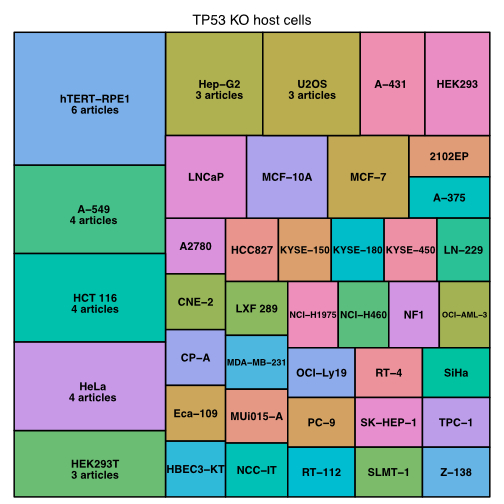

## Overview

TP53 is the most frequently knocked-out gene in mammalian cells since the invention of CRISPR technology in 2012; Looking at 3782 CRISPR-related articles indexed in Pubmed central since 2012 shows TP53, with 66 times knock-out in different studies, is the most studied gene among 2479 individually knocked-out genes in mammalian cells. Furthermore, we found this gene has been knocked out in 41 host cell lines, indicating, in total, 25 times duplicate work by research groups! Among [tp53 KO cell-lines](https://addcell.org/explore?s=tp53), the hTERT-RPE1 cell line has been used as the host for the knocking out of TP53 in six different studies. The hTERT-immortalized retinal pigment epithelial cell line, hTERT RPE-1, is widely used in research to model cell division and DNA repair!

